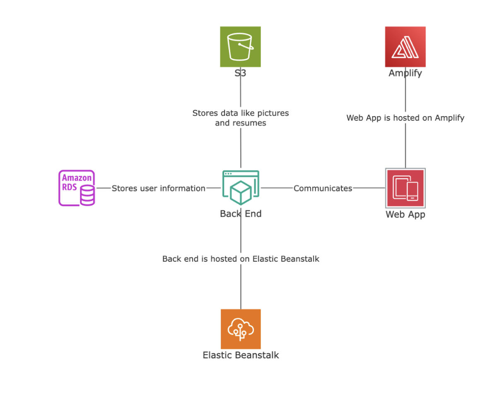

# Workify - CSI4900 Honours Project  

**A Modern Take on the Co-op Experience**

**Created by**: 
- Ali Bhangu 
- Tolu Emoruwa 
- Justin Wang

## Project Overview

Workify is an innovative take on revolutionizing the co-op experience for both employers and employees. Unlike traditional co-op boards that simply list available positions, Workify focuses on finding what "works" for each individual user through personalized matching, intuitive design, and comprehensive profile management.

## System Design



### Architecture Overview
- Frontend: React.js
- Backend: Express.js | Node.js
- Database: SQL, more specifically Amazon RDS


## Prerequisites
Before running this project locally, ensure you have the following installed:

- **Node.js** (version 20 or higher)
- **npm** (comes with Node.js) or **yarn**

## Local Setup

1. **Clone the repository**
```bash
git clone <repository-url>
cd Workify
```

2. **Navigate to the project directory**
```bash
cd workify
```

3. **Install dependencies**
```bash
npm install
```

4. **Start the development server**
```bash
npm run dev
```

5. **Open your browser**
Navigate to `http://localhost:5173` (or the port shown in your terminal)

## Dependencies

This project uses the following main dependencies:

- **React** (18+) - Frontend framework
- **React Router DOM** - Client-side routing
- **Vite** - Build tool and development server

### Development Dependencies
- **@vitejs/plugin-react** - Vite plugin for React
- **ESLint** - Code linting
- **CSS3** - Styling

## Available Scripts

- `npm run dev` - Start development server
- `npm run build` - Build for production
- `npm run preview` - Preview production build
- `npm run lint` - Run ESLint

## Project Structure

```
workify/
├── src/
│   ├── assets/          # Images and static assets
│   ├── common/          # Shared components (Header, etc.)
│   ├── jobs/            # Job listing components
│   ├── profile/         # User profile components
│   ├── sign-up/         # Registration components
│   ├── App.jsx          # Main app component
│   ├── Landing.jsx      # Landing page
│   └── main.jsx         # App entry point
├── public/              # Public assets
|── docs/                # Project documentation
└── package.json         # Project dependencies
